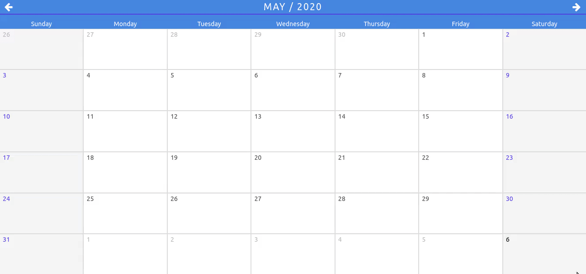
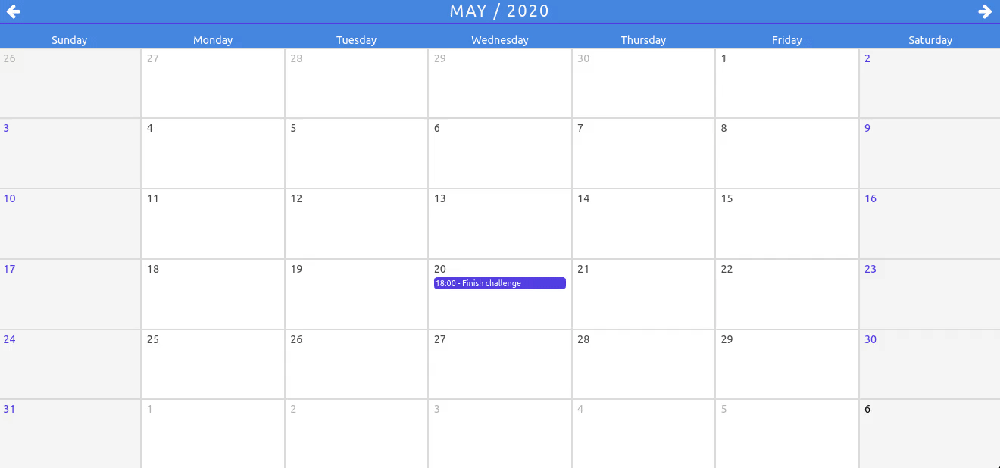
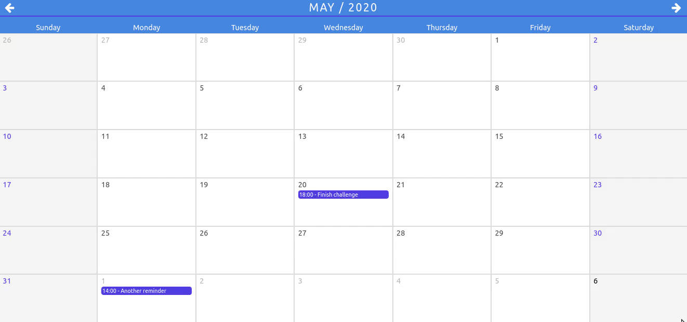

# react-calendar

This projects features a simple calendar created totally from scratch using:

- [Axios](https://github.com/axios/axios#example)
- [BulmaCSS](https://bulma.io/documentation/overview/start/)
- [RamdaJS](https://ramdajs.com/docs/)
- [ReactJS](https://reactjs.org/docs/getting-started.html)
- [React/Redux](https://react-redux.js.org/introduction/quick-start)
- [MomentJS](https://momentjs.com/docs/#/use-it/node-js/)

## Requirements

- Node v12+
- Npm v6.12+

This projects suports `nvm`, please consider using it to install `node` and `npm` correct versions:

```sh
nvm install v12
nvm use
```

_This projects include a versioned `.env`, with all configuration that you may need._

## Installation

Run `npm install`

## Usage

Run `npm run start:dev`

This will bring up `json-server` running on port `4000` and the application running on port `3000`.
Your browser should automatically open at http://localhost:3000.

This projects aims for **production**, so you could also bring the application up with `npm run start`, _but you will also need to provide a backend application!_

## Records

### Create and update reminder



### Month navigation



### Remove reminder



## Documentation

- [Considerations](./docs/CONSIDERATIONS.md)
- [Specifications](./docs/SPECIFICATIONS.md)
- [To do](./docs/TODO.md)

---

romajs - 2020
